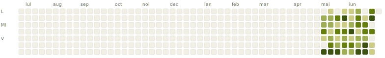
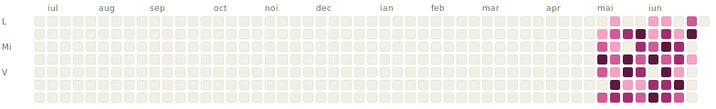

# Evenimente București

Listă zilnică a evenimentelor din București disponibile pe lu.ma, plus evenimente din calendare selectate manual care nu apar în descoperirea geografică. Actualizat zilnic la 06:00 UTC.

> Datele provin de la lu.ma, supuse Termenilor lor.

## Următoarele 14 zile

### Marți, 5 mai

- 17:30 **To Seek or To Submit? – Cum distingem între adevăr, influență și iluzie în era AI?** — Storyada.ro [↗](https://lu.ma/ux9imc32)
- 19:30 **321sport - Alergare Herăstrău (începători) #dela1la21 S22E57** — 321sport · 14 participanți [↗](https://lu.ma/nwose5n7)

### Miercuri, 6 mai

- 19:00 **Alergare 321sport x Good Routine - Intervale și diferență de nivel** — 321sport · 22 de participanți [↗](https://lu.ma/fhld14hm)
- 19:30 **#4 - Run this Town** — FOMO Urban Running Club · 24 de participanți [↗](https://lu.ma/z4zzgqtl)

### Joi, 7 mai

- 09:00 **LiT Unfiltered#4 w/ Laurent Marini** — Bogdan Popescu [↗](https://lu.ma/litunfiltered4)
- 18:30 **Upskilling the Romanian IT Industry - From Execution to Strategy** — Andra Ghibutiu · 58 de participanți [↗](https://lu.ma/gq2gavvy)
- 19:00 **Bucharest Tech Mixer \| Agentic AI Edition** — Neo Mixers by ▲promocrat · 113 de participanți [↗](https://lu.ma/93vvlbv5)
- 19:00 **321sport - Alergare pistă Lia Manoliu (avansați + începători) #dela1la21 S22E58** — 321sport · 4 participanți [↗](https://lu.ma/n3oxxq26)

### Vineri, 8 mai

- 18:30 **321sport x Under Armour - Bucharest Half Marathon Shakeout Run** — 321sport · 5 participanți [↗](https://lu.ma/3oyn2w7i)

### Duminică, 10 mai

🚶 5 ture de duminică

- 09:00 **Tura de duminică I.O.R.** — Irina Tenovici · 2 participanți [↗](https://lu.ma/5la8ledz)
- 09:00 **Tura de duminică Tineretului** — Nicoleta Ifrim · 2 participanți [↗](https://lu.ma/vtwu1pph)
- 09:00 **Tura de duminică Lacul Morii** — Alexandru Agatinei · 1 participant [↗](https://lu.ma/1yepuzpv)
- 09:00 **Tura de duminică Herăstrău** — Emily Merdus · 1 participant [↗](https://lu.ma/620ya3nn)
- 09:00 **Tura de duminică Cotroceni** — Aleodor Tabarcea · 2 participanți [↗](https://lu.ma/b0m7lckq)

### Luni, 11 mai

- 18:45 **Meet 25 Interesting People… Then Grab a Padel Racket** — Eric Melchor · 29 de participanți [↗](https://lu.ma/ywd0192g)

### Marți, 12 mai

- 19:00 **🌿🤖 Lansare Bucharest Techies** — Metapilot Academy · 9 participanți [↗](https://lu.ma/e7nwf757)
- 19:30 **321sport - Alergare Herăstrău (începători) #dela1la21 S22E59** — 321sport · 3 participanți [↗](https://lu.ma/wjl4w48x)

### Miercuri, 13 mai

- 08:30 **RoFintech Breakfast \| Hosted by Fort** — Adrian Drinceanu [↗](https://lu.ma/hifstc48)

### Vineri, 15 mai

- 18:30 **Metalurgiei Meetup @ Colibri: vin, pictură și oameni faini 🎨🍷** — Loredana Pipie · 5 participanți [↗](https://lu.ma/5ip0alku)

### Duminică, 17 mai

🚶 4 ture de duminică

- 09:00 **Tura de duminică Herăstrău** — Emily Merdus [↗](https://lu.ma/vx9erfaw)
- 09:00 **Tura de duminică Tineretului** — Nicoleta Ifrim [↗](https://lu.ma/klue245w)
- 09:00 **Tura de duminică I.O.R.** — Irina Tenovici [↗](https://lu.ma/achw46vz)
- 09:00 **Tura de duminică Cotroceni** — Aleodor Tabarcea [↗](https://lu.ma/kmmsdxlo)

## Activitate (ultimele 365 de zile)

### Evenimente pe zi

### Participanți pe zi

## Despre

*Hărțile de activitate se populează în timp — pornesc goale și ating vederea completă de 365 de zile după un an.*

Date: `data/events.csv` (stare curentă, cumulativă) · `data/snapshots/` (arhivă zilnică brută) · `data/scrape_errors.csv` (jurnalul rulărilor care au eșuat parțial) · `data/schema.json` (amprenta câmpurilor API).

Cod: [scripts/](scripts/) · Workflow: [.github/workflows/scrape.yml](.github/workflows/scrape.yml).

---

*Actualizat: 5 mai 2026 la 16:01*
